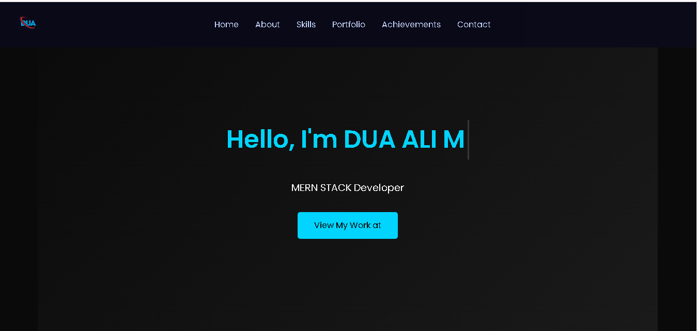
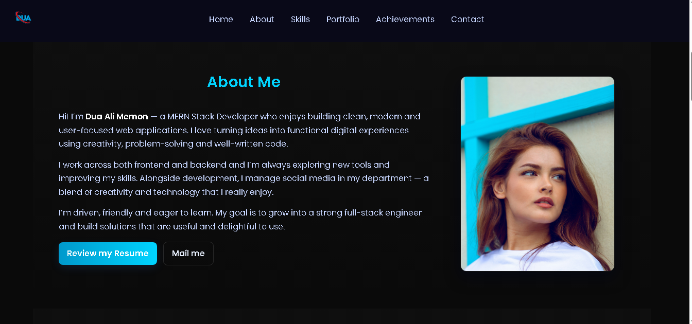
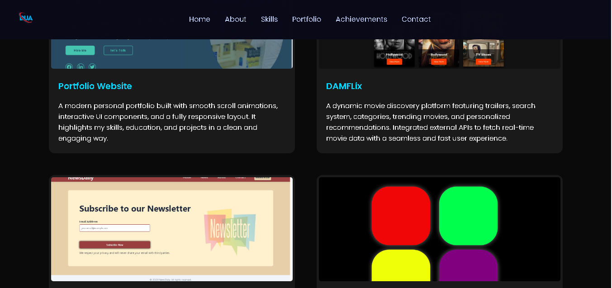
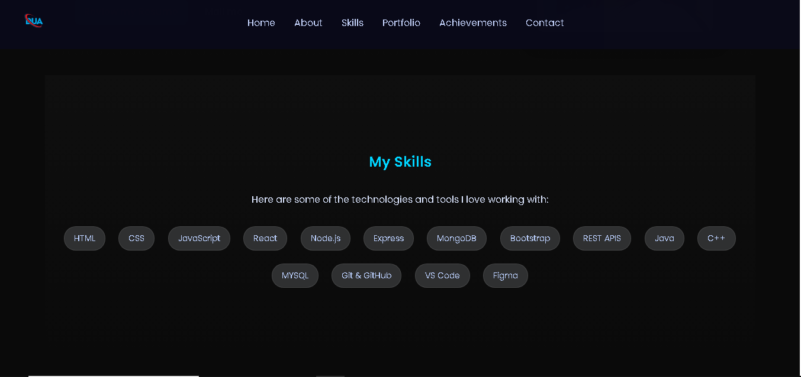

## ✨ Features

- 🎯 Advanced Typing Animation in Hero Section  
- 💫 Smooth Scroll & Section Fade-In Animations  
- 🔥 Fully Responsive Design for Mobile, Tablet, Desktop  
- 💼 Projects Section with Clickable Live Previews  
- 🧩 Skills Section with Animated Badges  
- 🏆 Achievements & Experience Timeline  
- 🌈 Minimal & Modern UI Design  
- ⚡ Lightweight, Fast and SEO Friendly

---

## 💼 Projects

### 1️⃣ Portfolio Website
Interactive animations, smooth UI, responsive layout.

### 2️⃣ DAMFlix — Movie Recommendation Web App
Search movies, watch trailers, explore top-rated movies via APIs.

### 3️⃣ News Website (API Integrated)
Fetches latest news with categories and search functionality.

### 4️⃣ Simon Says Game
Fun color memory game built with JS logic.

---
## 🖼️ Screenshots

### Home Section

### About Section

### Projects Section

### Skills Section

---
## 🚀 Live Demo
🔗 [View My Portfolio](http://my-portfolio-three-tau-61.vercel.app/)

## 🛠️ Tech Stack & Tools

- 🌐 **HTML5**  
- 🎨 **CSS3** (Flexbox, Grid, Animations)  
- 💻 **JavaScript (ES6+)**  
- ⚡ **Responsive Design Techniques**  
- 🖼️ **Images & Assets Management**  
- 📧 **Email Integration** (Contact form)  
- 💬 **WhatsApp API / Links**  
- 📄 **Resume Integration / Download**  
- 🔤 **Google Fonts** (Custom Typography)  

## 📬 Contact

📧 Email: memonduaa544@gmail.com  
🔗 LinkedIn: [Dua Ali Memon](https://www.linkedin.com/in/dua-alee-memon-a9b0a72a6/)  
🐙 GitHub: [DuaAliMemon](https://github.com/Duaalimemon)

---
## 📝 License
© 2025 Dua Ali Memon — All Rights Reserved.

